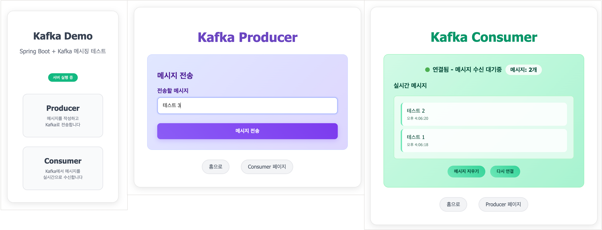

# OCI Managed Kafka - Spring Boot Demo

Oracle Cloud Infrastructure (OCI) Kafka와 Spring Boot를 사용한 실시간 메시징 데모 애플리케이션



## 기능

- **Kafka Producer**: REST API를 통한 메시지 발송
- **Kafka Consumer**: 실시간 메시지 수신 
- **WebSocket**: STOMP over SockJS를 사용한 실시간 브로드캐스팅
- **Web UI**: Producer/Consumer 분리된 인터페이스
- **실시간 메시징**: 브라우저 간 실시간 메시지 동기화

## 기술 스택

- Spring Boot 3.5.6
- Java 17
- Maven
- Spring Kafka
- Spring WebSocket
- SockJS + STOMP
- HTML/CSS/JavaScript

## OCI VM에서 실행 방법

### 1. 프로젝트 클론
```bash
git clone https://github.com/AndyPandi/oci-kafka-springboot.git
cd oci-kafka-springboot
```

### 2. Kafka 설정 확인
`src/main/resources/application.yml` 파일에서 Kafka 연결 정보 확인:
```yaml
spring:
  kafka:
    bootstrap-servers: bootstrap-clstr-xxxxxxxx.kafka.ap-chuncheon-1.oci.oraclecloud.com:9092
    properties:
      security.protocol: SASL_SSL
      sasl.mechanism: SCRAM-SHA-512
      sasl.jaas.config: org.apache.kafka.common.security.scram.ScramLoginModule required username="xxxx" password="xxxxx";
```

**참고**: OCI Kafka 클러스터는 VCN 내부에서만 접근 가능합니다.

### 3. 애플리케이션 실행
```bash
./mvnw spring-boot:run
```

### 4. 웹 브라우저에서 테스트
- **메인 페이지**: `http://VM_IP:8080`
- **Producer 페이지**: `http://VM_IP:8080/producer.html` - 메시지 전송
- **Consumer 페이지**: `http://VM_IP:8080/consumer.html` - 실시간 메시지 수신

### 5. 사용 방법
1. Producer 페이지에서 메시지 입력 후 전송
2. Consumer 페이지에서 실시간으로 메시지 수신 확인
3. 여러 브라우저 탭에서 동시 테스트 가능

## 아키텍처

```
Browser → REST API (/api/publish) → Kafka Producer → Kafka Topic
                                                          ↓
Browser ← WebSocket (/topic/messages) ← Kafka Consumer ←
```

## 주요 파일

### Backend
- `KafkaProducerService.java`: Kafka 메시지 발송
- `KafkaConsumerService.java`: Kafka 메시지 수신 및 WebSocket 브로드캐스트  
- `MessageController.java`: REST API 엔드포인트 (/api/publish)
- `WebSocketConfig.java`: WebSocket/STOMP 설정
- `KafkaConfig.java`: Kafka 토픽 설정

### Frontend
- `index.html`: 메인 페이지 (Producer/Consumer 선택)
- `producer.html`: 메시지 전송 인터페이스
- `consumer.html`: 실시간 메시지 수신 인터페이스

### Configuration
- `application.yml`: Kafka 연결 설정 및 로그 레벨 설정
